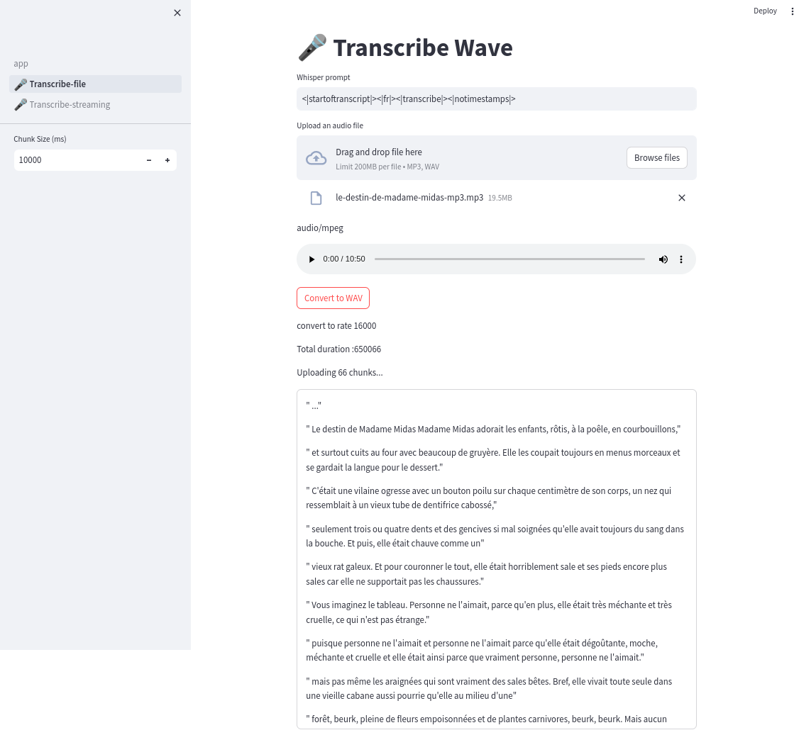
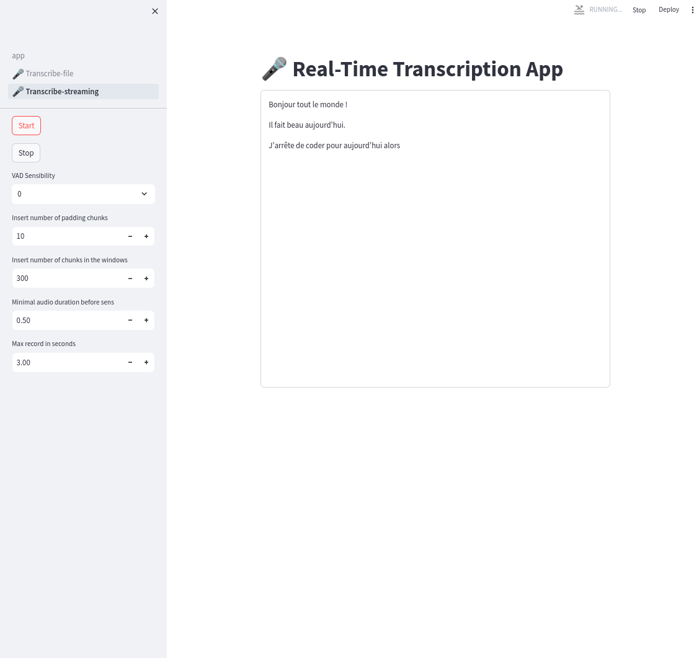

# Description

Experiments 

## Whisper

Using  https://github.com/dminier/whisper-triton-api

### 🎤-Transcribe-file

Upload MP3 and Wave, split if necessary and apply http.post

### 🎤-Transcribe-streaming

Speak through microphone

### 3-🤖-conversation-chatbot.py

A very simple chat bot.

### 4-📑-rag-chatbot.py
(in progress)
* Rag chat bot with Qdrant VectorStore.
* Load Web document 

